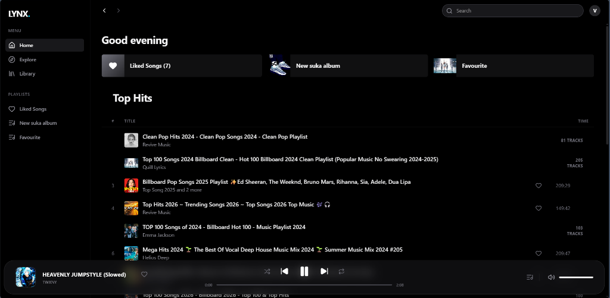
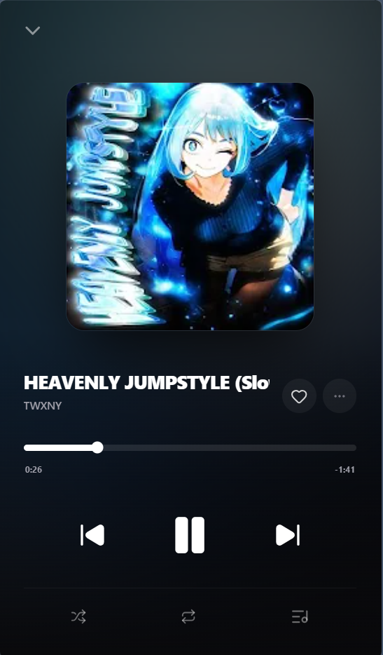

# Lynx - Freedom of Music

<div align="center">
  
</div>

Lynx is a minimalist, premium music streaming application designed for those who value privacy, speed, and visual excellence. Built with a modern "Liquid Glass" aesthetic, Lynx offers a seamless experience across desktop and mobile.

## ✨ Features

- **Floating Island Player**: A state-of-the-art, glassmorphism-inspired desktop playback bar that stays out of your way while providing full control.
- **Immersive Mobile View**: High-contrast, full-screen playback with vibrant blurred thumbnail backgrounds and intuitive gestures.
- **Dynamic Queue Management**: Real-time queue viewing and instant navigation between tracks.
- **Personal Library**: Full integration with Firebase for managing your liked songs and custom playlists.
- **Cross-Platform**: Powered by Capacitor for a native-like experience on Android and Web.
- **Privacy Focused**: Ad-free streaming powered by public Piped/YouTube instances.

## 📱 Mobile Experience

<div align="center">
  
</div>

## 🛠️ Technical Stack

- **Core**: Vite + React + TypeScript
- **Styling**: Vanilla CSS + Tailwind CSS (Liquid Glass Design System)
- **Backend**: Firebase (Auth & Firestore)
- **Native**: Capacitor (Android Service Integration)
- **Icons**: Lucide React
- **Streaming**: Piped API / YouTube

## 🚀 Getting Started

### Prerequisites
- Node.js (v18+)
- Firebase Project

### Setup
1. Clone the repository
2. Install dependencies:
   ```bash
   npm install
   ```
3. Create a `.env` file based on `.env.example` and add your Firebase credentials:
   ```env
   VITE_FIREBASE_API_KEY=your_key
   VITE_FIREBASE_AUTH_DOMAIN=your_project.firebaseapp.com
   VITE_FIREBASE_PROJECT_ID=your_project
   ...
   ```
4. Start development server:
   ```bash
   npm run dev
   ```

## 📄 License
This project is for personal and educational use.

---
*Follow the rhythm.*
